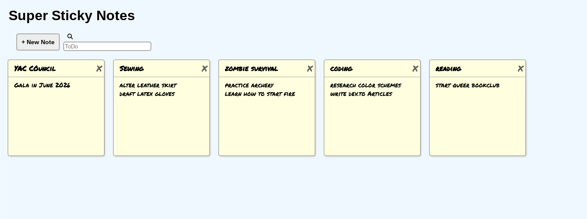

# 📝 Super Sticky Notes

A React app for creating, editing, searching, and deleting sticky notes — with notes that persist between sessions using `localStorage`.

## Features

- **Create notes** — add as many sticky notes as you need
- **Edit in place** — click directly on a note's title or body to start typing
- **Delete notes** — remove any note with a single click
- **Live search** — filter notes by title or description in real time
- **Persistent storage** — notes are saved to `localStorage` so they survive page refreshes

## Tech Stack

- React 16 (class components)
- Vanilla CSS
- `localStorage` for persistence
- No external UI libraries — layout and styling written from scratch

## What I Built

This project gave me hands-on practice with core React concepts:

- **Component architecture** — broke the UI into `App`, `Header`, `NotesList`, and `Note` components with clear responsibilities
- **State management** — managed a shared notes array in `App` and passed data down via props
- **Lifting state up** — events like typing and deleting originate in child components but update state in the parent
- **Controlled components** — form inputs are fully controlled via React state
- **Lifecycle methods** — used `componentDidMount` and `componentDidUpdate` to read and write to `localStorage`
- **Array methods** — used `.map()`, `.filter()`, and spread syntax throughout to update state immutably

## Getting Started

```bash
npm install
npm start
```

The app will run at `https://sticky-notes-pearl-two.vercel.app/`.

## Project Structure

```
src/
├── App.js          # Root component; holds all state and core logic
├── Header.js       # Search bar and "New Note" button
├── NotesList.js    # Filters notes and renders the list
├── Note.js         # Individual note with editable title, body, and delete
├── index.js        # Entry point
└── index.css       # All styles
```

## Screenshots




## What I'd Add Next

- Color picker to customize individual note colors
- Drag-and-drop reordering
- A character limit warning on the note body
- Migrate to functional components with hooks (`useState`, `useEffect`)
